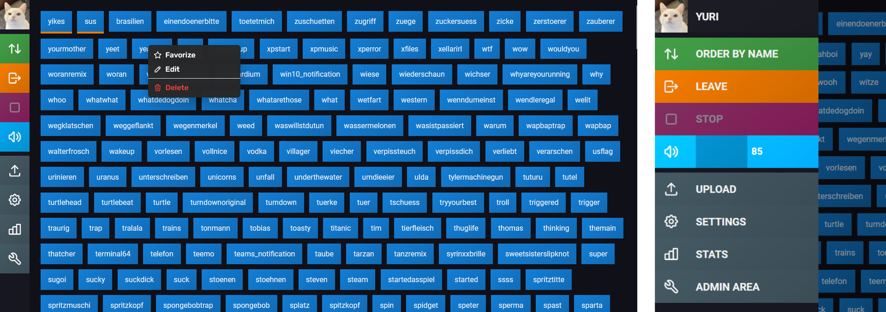
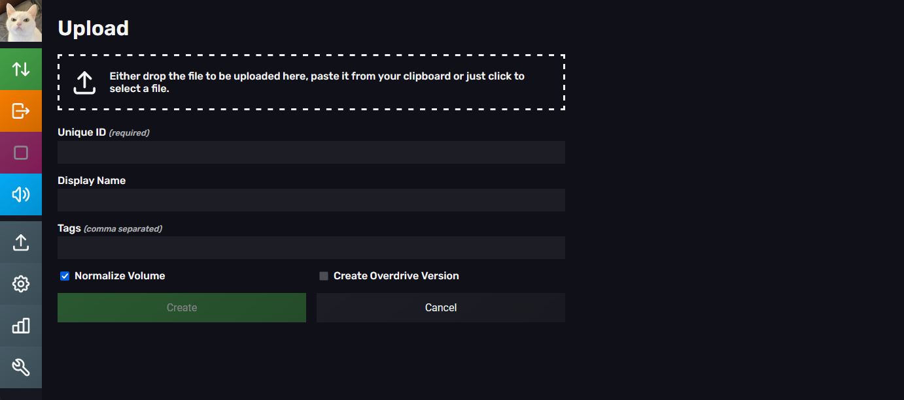
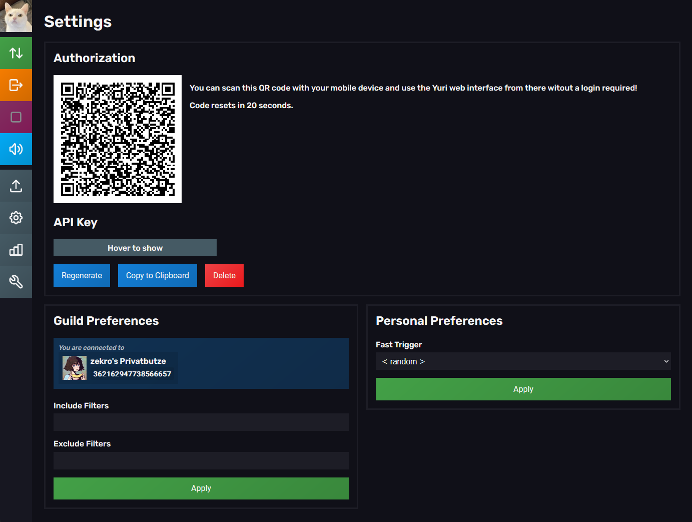
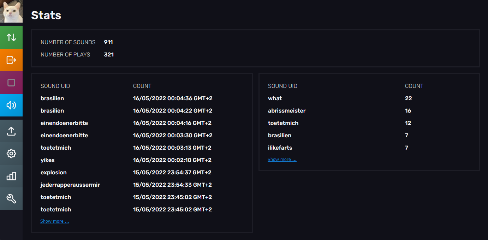
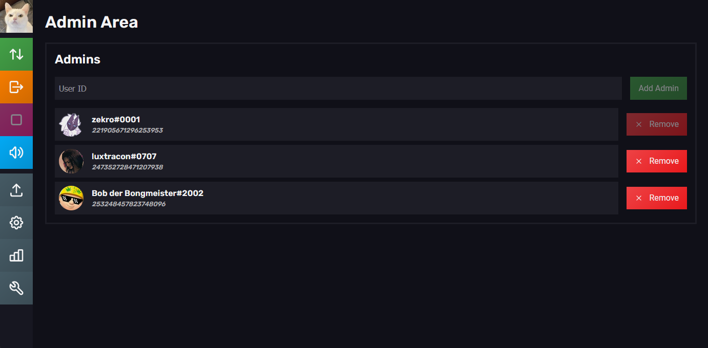

     
     <h1>~ YURI 69 ~</h1>
     <strong>Even faster, harder, louder! The best Discord Soundboard you can get - Successor of <a href="https://github.com/zekroTJA/yuri2">yuri2</a></strong>  
     &nbsp;
     &nbsp;
     &nbsp;
     

---

Yuri69 is the next level of Discord Sound Boards. Featuring a fancy web interface where you can manage all your sounds, hotkey control, an open REST API to connect to devices like a Stream Deck, for example, and much more!

## Features

You can log in to the web interface using your Discord Account (via [OAuth2](https://oauth.net/2/)). There you can list, search, filter, upload, edit, favorize and remove sounds as well as managing the player state (join/leave chanel, stop playback, manage volume). Also, you can set personal settings like the hotkey trigger or guild filters for random sound playback.

You can directly upload sounds via the web interface. There you can specify a unique ID, displayname and tags. These tags can be used for filtering and searching sounds. All uploaded files are converted using [FFMPEG](https://ffmpeg.org/) to be stored in an optimized file state for playback. 

When going to the setting page, you can scan the displayed QR code using your mobile device to control the sound board from another device! You can also obtain an API key there to, for exmaple, play sounds from a stream deck or batch-upload sounds you have laying around (see [scripts/upload.sh](scripts/upload.sh)).

There are also some general playback stats like a playback log or a list of most played sounds.

Things like deletings or editing sounds uploaded by other users require admin permissions. These can be set in the admin panel. You need to specify yourself as `owner` in the config to get initial access to this panel and to add other admins.

## Setup

*Coming soon™️*

## API Documentation

*Coming soon™️*